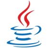

_(This page is incomplete. WIP Nov 2020.)_

My `java` repository is a polyglot collection of Java examples that demonstrate language features, frameworks, techniques, and patterns. Includes Clojure, Groovy, Kotlin, and Scala. Builds with Maven or Gradle. Tests with JUnit and Spock.

`Clojure` `GraphQL` `Gradle` `Groovy` `Java` `JUnit` `Kotlin` `Maven` `Scala` `Spock` `Spring`

## Languages

### Java

My first exposure to `Java`  goes back to applets in version 1.0, in 1996. I've been working professionally with Java non-stop ever since (both client and server-side). I attended my first JavaOne event in San Francisco in 1999 (v1.2).

The Java Virtual Machine (JVM) has always been especially interesting for its polyglot capabilities. To that point, I've done significant production work with `Groovy` and `Kotlin`. I've used `Scala` and `Clojure` to a lesser extent.

### Groovy

My first professional work with `Groovy` was from 2008-2011. The Groovy-based platform, `Grails`, had just been released. At the ISV where I worked at the time I introduced and bootstrapped a new product and technology stack revolving around Grails and the `Drools` Rules Engine. That ISV still uses Grails as the foundation of their technology stack to this day (in 2020).

### Kotlin

After 2015, I enhanced the previously Java-only stack at **barometerIT** to include a polyglot mix of interopereable JVM-based languages. Groovy, Kotlin, Scala, and Clojure were intermingled with Java. Of these, **Kotlin** is the language that obtained the most traction (with myself and others).

## Frameworks

### Spring

In the fast-moving world of programming frameworks, it's surprising to find Spring and Hibernate remain such key components in robust, feature-rich server-side applications. I've also done production work with Grails (which is built around Groovy, Spring, and Hibernate, and was originally a Spring project).

I worked with the original releases of Spring at Notiva in 2002, when "inversion of control", "injection", and "loose coupling" were the thing.

Spring AOP (Aspect-oriented Programming), Spring Batch, Spring Boot, Spring Data, Spring Integration, Spring Security.

### Hibernate (and JPA)

My first exposure to Hibernate would have been with the original version, at SPS Commerce in 2001, although my first heavy-duty production work probably started at Notiva in 2002.

### ActiveMQ (and JMS)

Over the years I've worked with a number of message queueing (MQ) systems. I call out Apache ActiveMQ here only because it's the most recent and relevant (cf. Amazon MQ, which is an implementation).

### Solr

My first work was probably directly with Lucene (after 1999), and only later Solr (after 2007).
